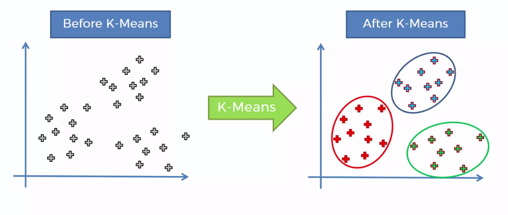
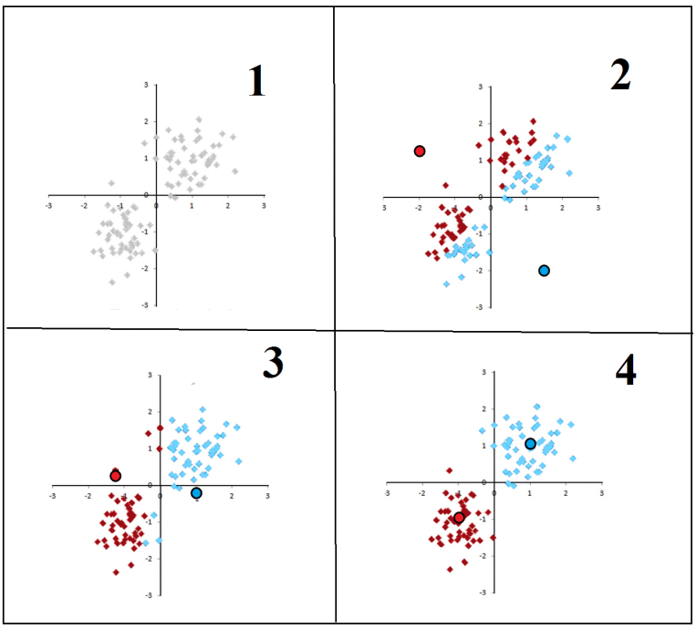
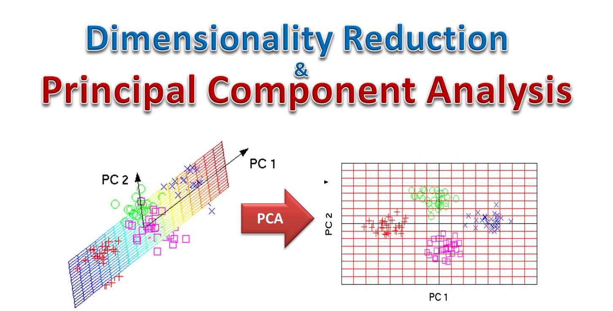

# A. Libraries and Data Preparation/Visualization

## Getting Started

We will load the necessary libraries.

```{r libraries}
## 1.1: Importing required packages
library(dplyr)
library(ggplot2)
library(cluster)
```

##  Import Data

```{r customer data}

## 2.1: Import the "Mall_Customers.csv" data 

data <- read.csv("Mall_Customers.csv")

## 2.2: View the dataset

View(data)

## 2.3: Check the names of columns and structure of the dataset

names(data)
str(data)

## 2.4: Rename some column names

data <- rename(data, annual_income = Annual.Income..k..,
       spending_score = Spending.Score..1.100.)

## 2.5 Take a peek at the data using the head & tail function

head(data)
tail(data)

## 2.5: Summarize the data

summary(data)
```


## Data Visualization 

### Part One

Visualization of some variables in the dataset.

```{r viz part 1}

## 3.1: Create a barplot for the variable "Gender"

ggplot(data = data) + geom_bar(aes(x = Gender),
                                   fill = "cyan") + theme_minimal() + 
  labs(title = "Barplot to display Gender Comparison",
       xlab = "Gender") 

## Mini-challenge 2: Create a histogram for the variable "Age"

ggplot(data = data,aes(x = Age)) + geom_histogram(binwidth = 1) + 
  labs(title = "Histogram to show Age distribution") + theme_bw()

## 3.2: Add a density line to the histogram of Age

ggplot(data, aes(x = Age)) +
  geom_vline(aes(xintercept = mean(Age)), color = "blue",
             linetype = "dashed", size = 1.5) +
  geom_histogram(binwidth = 5, aes(y = ..density..), 
                 color = "black", fill = "white") +
  geom_density(alpha = 0.4, fill = "red") +
  labs(title = "Histogram to Show Density of Age Class")

## 3.3: Create a histogram for the variable "Age" by Gender

ggplot(data = data,aes(x = Age,fill = Gender,color = Gender)) + 
  geom_histogram(bins = 10,position = "identity",alpha = 0.5) 

## 3.4 Same with dodge position 

ggplot(data = data,aes(x = Age,fill = Gender,color = Gender)) +
  geom_histogram(bins = 10,position = "dodge")
```

### Part Two


```{r viz part 2}

## 4.1: Create a density for the variable "annual_income"

ggplot(data = data,aes(x = annual_income)) + geom_density(fill = "blue",alpha = 0.5,color = "red") + 
  labs(title = "Density Plot For The Annual Income Variable")

## Mini-challenge 3: Create a boxplot for the variable "spending_score"

ggplot(data, aes(x = spending_score, y= Gender)) +
  geom_boxplot() +
  labs(title = "Boxplot For The Spending Score Variable")
```

# B. K-Means Algorithm Imprementation Metrics & Hyperparameters


## Task Five: Understand the Concept of K-Means

In this task, we will understand the theory and intuition
behind the K-Means Algorithm

```{r eplanation k-means,echo = FALSE,fig.cap = "K-Means Intuition",out.width = '100%'}


# Source: K-Means Clustering Ayush Kalla on Data Driven Investor
# https://medium.datadriveninvestor.com/k-means-clustering-4a700d4a4720 
```

```{r algorithm explained}
#### Steps for K-Means Algorithm:
# 1. Choose the number of clusters "K"
# 2. Select random K points that are going to be the centroids for each cluster
# 3. Assign each data point to the nearest centroid, doing so will enable us to 
#    create "K" number of clusters
# 4. Calculate a new centroid for each cluster
# 5. Reassign each data point to the new closest centroid
# 6. Go to step 4 and repeat

# Source: A course by Dr. Ryan Ahmed on Unsupervised Machine Learning
```

```{r kmean steps,echo=FALSE, fig.cap="Steps for K-Means Algorithm",out.width = '100%'}


# Source: Analysis of an Event Forecasting Method for Wireless Sensor Networks by Andras Kalmar et al.
```

## Task Six: Determine the number of clusters

In this task, we will learn how to get the optimal number of clusters for the data

```{r determine K}

## Mini-challenge 4: Set seed to 125

set.seed(125)

## 6.1: Get the optimal number of clusters

stat_gap <- clusGap(data[,3:5],FUN = kmeans,nstart = 25,K.max = 10,B = 50)

## Mini-challenge 5: Plot the optimal number of clusters 
## using the plot function

plot(stat_gap)

## Optimal K = 6
```

## Task Seven: K-Means Clustering
In this task, we will create a K-Means clustering model for the data.

```{r k-means clustering}

## 7.1: Create the customer clusters with k-means

## The optimal K = 6 so we train the data with kmeans built in function

K6 <- kmeans(data[,3:5],centers = 6,iter.max = 100,nstart = 50,algorithm = "Lloyd")

## Print the result

K6

## 7.2: Show the six K-Means clusters

clusplot(data, K6$cluster, color=TRUE, shade=TRUE, labels=0, lines=0)
```

## Task Eight: Principal Component Analysis

In this task, we will perform Principal Component Analysis and apply it to the dataset.

```{r pressure, echo=FALSE, fig.cap="PCA-explained", out.width = '100%'}


#Source: A complete guide to Principal Component Analysis - PCA in Machine Learning
# ashutoshtripathi.com/2019/07/11/a-complete-guide-to-principal-component-analysis-pca-in-machine-learning
```

```{r pca}

## 8.1: Perform Principal Component Analysis

pcclust <- prcomp(data[,3:5],scale = FALSE)

## Mini-challenge 6: Check the summary of the PCA model

summary(pcclust)

## 8.2: Apply the PCA model on the data

pcclust$rotation[,1:2]
```

## Task Nine: Plot the K-Means Segments

In this task, we will learn how to visualize the different customers clusters for the mall
customers data

```{r plot-by-cluster}

## 9.1: Set seed to 1

set.seed(1)

## 9.2: Create a plot of the customers segments

ggplot(data, aes(x = annual_income , y = spending_score)) + 
  geom_point(stat = "identity", aes(color = as.factor(K6$cluster))) +
  scale_color_discrete(name = " ", 
                       breaks=c("1", "2", "3", "4", "5","6"),
                       labels=c("Cluster 1", "Cluster 2", "Cluster 3", 
                                "Cluster 4", "Cluster 5","Cluster 6")) +
  ggtitle("Segments of Mall Customers", 
          subtitle = "Using K-means Clustering")
```
